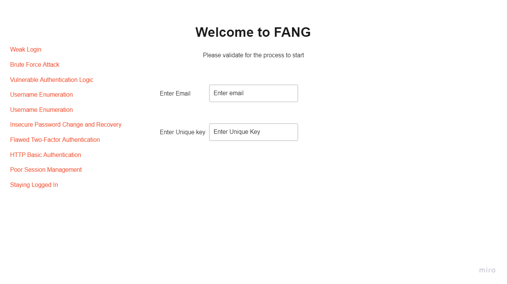
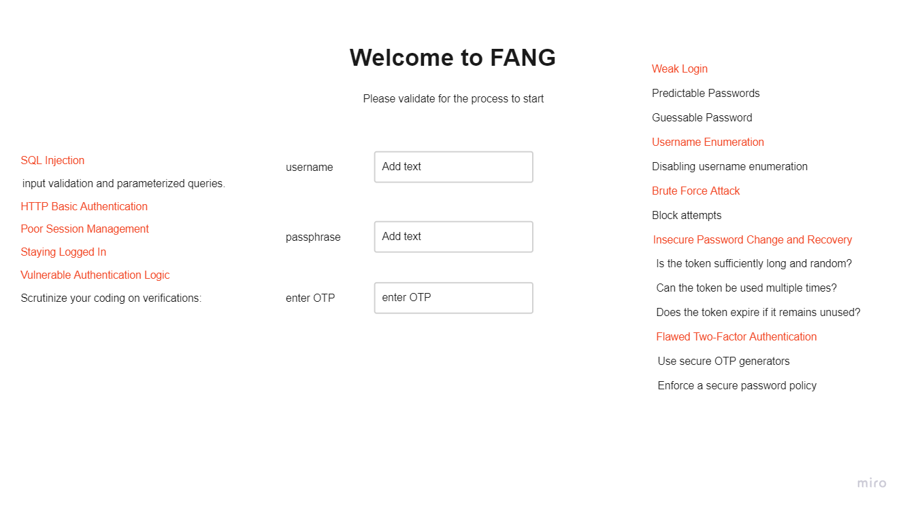

**Goal**

 
**The Journey**

#Week 1

##During Design

***Security Requirements***

- User management
- Authentication
- Authorization
- Data confidentiality
- Integrity
- Accountability
- Session management
- Transport security
- Tiered system segregation
- Legislative and standards compliance (including privacy, government, and industry standards)

** Step 1 : Basic Login and possible vulnerabilities **

Is started out with a standard login page and listed the common vulnerabilities.

** Step 2 : Improved vulnerabilities through design **

Next, I looked at the vulnerabilities that can be reduced through design.

- I removed any text and hints that can indicate to an hacker the possible solution
- I added additional steps   

***References***

[Testing for Account Enumeration and Guessable User Account](https://owasp.org/www-project-web-security-testing-guide/latest/4-Web_Application_Security_Testing/03-Identity_Management_Testing/README)

[11 Common Authentication Vulnerabilities You Need to Know](https://www.strongdm.com/blog/authentication-vulnerabilities)
#Week 2

- **categories of vulnerabilities**
    - **CVEs and CWEs**
    - **memory management vulnerabilities**
        
        attacks
        
        code corruption attacks
        
        control-fow hijack attacks
        
        information leak attack
        
        data-only-attacks
        
        safe languages
        
        temporal vulnerabilities
        
        spatial vulnerabilities
        
    - structured output generation vulnerabilities
        
        SQL injection
        
        command injection vulnerabilities
        
        script injection vulnerabilities (XSS)
        
        stored injection vulnerabilites
        
        higher-order injection vulnerabilities
        
    - **race condition vulnerabilities**
        
        concurrency bugs
        
        time-of-check to time-of-use
        
    - **API vulnerabilities**
        
        correct use
        
        correct implementation
        
    - **side-channel vulnerabilities**
        
        software-based side-channels
        
        covert channels
        
        micro-architectual effects
        
        fault-injection attacks
        
        physical fault-injection
        
        software fault-injection
        
         Rowhammer
        
    
- **prevention of vulnerabilities**
    - **API design**
        
        defensive programming
        
        sandboxing
        
        principle of least privilege
        
        assertions
        
        contracts
        
    - **coding practices**
        
        coding guidelines
        
        MISRA
        
        dangerous functions
        
        programming idioms
        
        resource acquisition is initialisation
        
        move semantics
        
        smart pointers
        
        checking compliance
        
    - **erroneous execution**
        
        trapped errors
        
        untrapped errors
        
    - **language design and type systems**
        
        memory management mitigations
        
        immutable state
        
        dynamic checks
        
        static checks
        
    - **structured output generations mitigations**
        
        type systems
        
        query generation
        
    - **race condition mitigation**
        
        ownership
        
        aliasing
        
    - **information flow**
- **mitigating exploitation**
    - **runtime detection of attacks**
        
        stack canaries
        non-executable memory
        
        control fow integrity
        
    - **automated software diversity**
        
        ASLR
        
    - **limiting privileges**
        - **sandboxing**
            
            monitors
            
            jails
            
        
        compartmentalisation
        
        object-capability systems
        
- **detection of vulnerabilities**