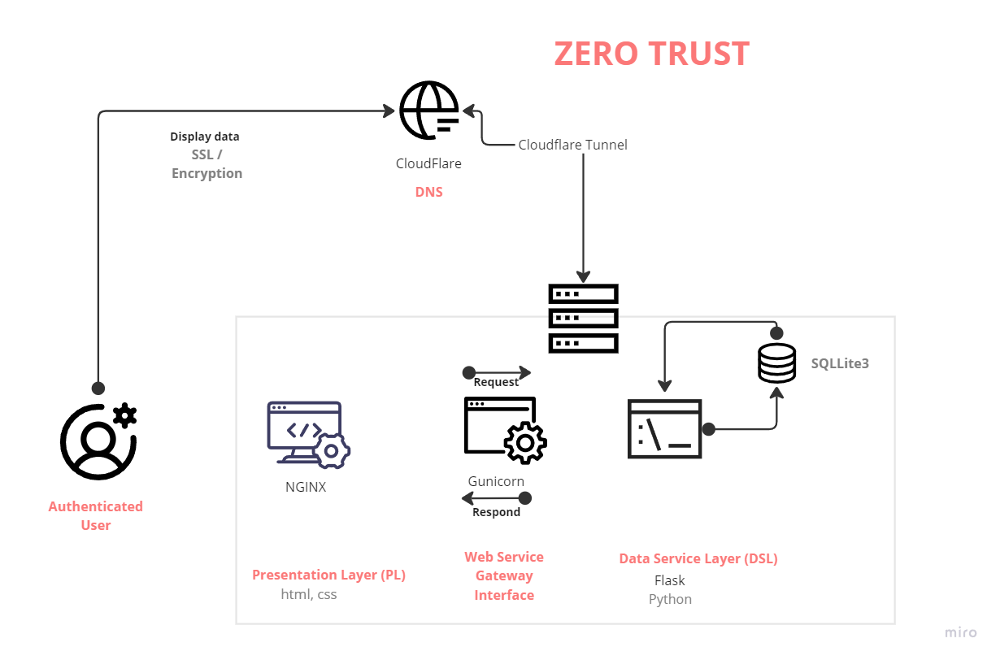

**Goal**

Secure Home network add webserver and finally, securely host my application following the Zero Trust model. I used this section to enchance my skills in Linux, get a bettter understanding on servers and network trafficking.

All steps/actions below was executed through self study and my first time doing any of them. The reason was that this is not part of my course curriculum but noticed that these are essential skills I need to master to be able to get into DevSecOps and Cybersecurity.  

**The Journey**

# Week 1

## Linux
- Hardware setup and Troubleshooting
    - DualBoot Windows with Ubuntu
        - 💢 Windows di dnot allow dualboot (linux or windows) until Bitlocker Key was entered. Did not have this key. [Found the solution thanks to Tricknology](https://www.youtube.com/watch?v=lY0Iz0NpAoU)
       

## Webserver

- Installing and maintaining web server hardware and software **NGINX** + **Gunicorn**
- Troubleshooting network and server failures and resolving issues

/Optimizing server networks and web application firewall configuration
/Reviewing and performance-testing existing server systems and web products
/Hardening networks, hosts, web servers and applications
/Implementing web server controls and active defense mechanisms
/Using command-line utilities to test web servers and extract logs

#Week 2

##CyBOK
**Security Goals in Networked Systems**
    
    Security Goals and Attacker Models
    

    

Attacker Models (add Original)

Python <-> Flask <-> Gunicorn <-> Nginx <=> Cloudflare
##Linux

/User account management
/Structured Query Language (SQL)
/Network traffic packet capture
/The vi editor
/Backup and restore
/Hardware setup and troubleshooting
/Network routers and firewalls
/Network switches

##Webserver

/Optimizing server networks and web application firewall configuration
/Reviewing and performance-testing existing server systems and web products
/Hardening networks, hosts, web servers and applications
/Implementing web server controls and active defense mechanisms
/Using command-line utilities to test web servers and extract logs

###Tools

Stack:

    App         Web Server Gateway Interface        Proxy Server    DNS and <Tunnel>
- Firewalls
- Scripting and programming laguages
- Knowledge of network design and infrastructure
- Security

Website hosting
DNS Services

#Week 3

**Week 2**

- Build Server on Linux Machine

- Host Flask application using Gunicorn & WSGI

- Connect Website using Cloudflare DNS and Tunnel Service

**Networking Applications**
    
    Local Area Networks (LANs)
    
    Connected Networks and the Internet
    
    Bus Networks
    
    **Wireless Networks**
    
    Fully Distributed Networks: DHTs and Unstructured P2P Networks
    
    Software-Defned Networking and Network Function Virtualisation

    
- **Network Protocols and Their Security**
    
    Security at the Application Layer
    
    **Email and Messaging Security**
    
    **Hyper Text Transfer Protocol Secure (HTTPS)**
    
    **DNS Security**
    
    Network Time Protocol (NTP) Security
    
    Distributed Hash Table (DHT) Security 
    
    Anonymous and Censorship-Free Communication
    
    Security at the Transport Layer
    
    TLS (Transport Layer Security)
    
    Public Key Infrastructure
    
    TCP Security
    
    UDP Security
    
    QUIC
    
    Security at the Internet Layer
    
    IPv4 Security
    
    IP Spoofng
    
    Fragmentation Attacks
    
    VPNs and IPsec
    
    NAT
    
    IPv6 Security
    
    Routing Security
    
    Within an Autonomous System (AS)
    
    Across ASs 	
    
    ICMP Security 
    
    Security on Link Layer
    
    Port-based Network Access Control (IEEE 802.1X)
    
    WAN Link-Layer Security
    
    Attacks on Ethernet Switches
    
    Address Resolution Protocol (ARP) / Neighbor Discovery Protocol (NDP)
    
    Network Segmentation
    
    Wireless Security
    
    Bus Security
    
- **Network Security Tools**
    
    Firewalling
    
    Application Gateway (AG)
    
    Circuit-level Gateway (CG)
    
    DMZ
    
    Intrusion Detection and Prevention Systems
    
    Intrusion Prevention System (IPS)
    
    Network Security Monitoring
    
    SDN and NFV Security 
    
    **Network Access Control**
    
    **Zero Trust Networking** 
    
    DoS Countermeasures
    
- **Other Network Security Topics**